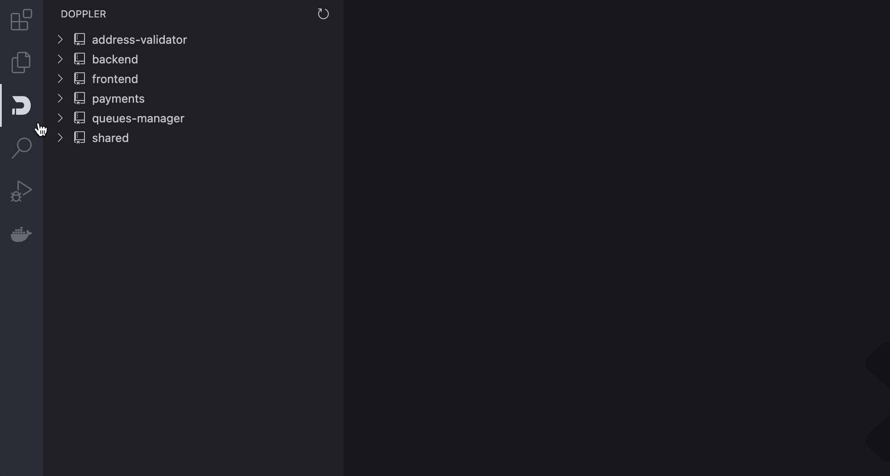
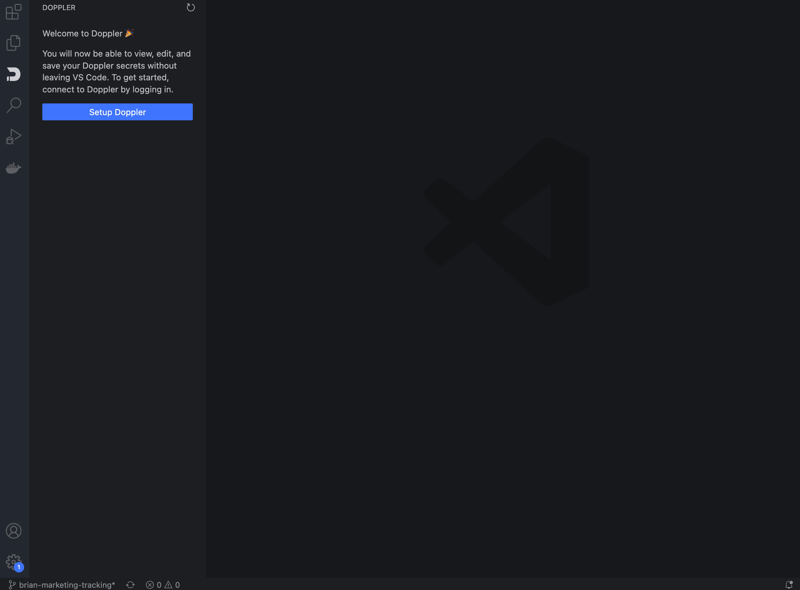
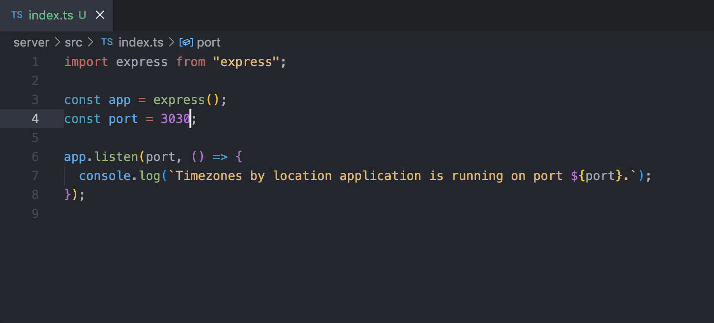
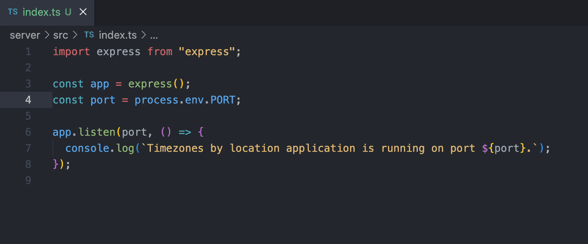
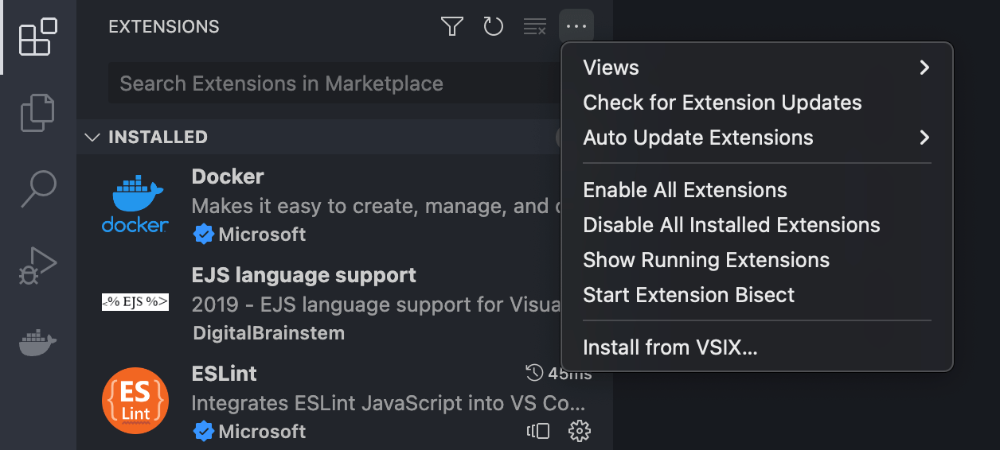

<div align="center">
  <a href="https://doppler.com">
    
  </a>
  </br></br>
  <h1>Official Doppler Extension</h1>
  <h3 align="center">
    Edit your secrets where you edit your code, with 2 way sync. Autocomplete
    suggestions and hover enrichment when using environment variables in your codebase.
  </h3>
</div>

</br>



</br>

## Installation

You can install Doppler's extension by going to the VS Code marketplace. Once in VS Code:

1. Open the **Extensions** sidebar in VS Code. `View → Extensions`
2. Search for `Doppler`
3. Select `Doppler` and click **Install**

## Easy Setup

Now that the extension has been installed, start the setup process. This will install the Doppler CLI if needed, authenticate, and configure the given workspace folder with a Doppler project and config used for autocomplete suggestions and hover enrichment.



### Windows

This extension works fine on Windows! Unfortunately, it does require [manually installing the CLI](https://docs.doppler.com/docs/install-cli#installation). All Doppler CLI commands are executed inside a spawned `cmd.exe` shell, so if you install the Doppler CLI via any method other than using `scoop`, then you'll need to manually update the `PATH` inside `cmd.exe` to get the extension working. Make sure you run `doppler login` after installing.

If you followed our instructions for installing via Git Bash, then you can update the `PATH` as follows:

1. Open `cmd.exe`.
2. Run `SETX PATH "%PATH%;%HOMEDRIVE%%HOMEPATH%\bin"`.
3. Restart `cmd.exe` and type `doppler` at the prompt. You should see the Doppler CLI help output.
4. Restart VSCode. The extension should stop prompting you to setup and should display your Doppler projects.

You can update the `SETX` command above to append whatever path you installed the Doppler CLI to if you didn't follow our Git Bash instructions verbatim.

## Edit Secrets

In the Doppler sidebar, you will see a list of all your projects. When you click into a project, a list of its enviroments and configs are shown in the tree. Click on a config to edit its secrets.

When a config is clicked, a new file tab will open with your secrets in the format of a YAML file. This is a virtual file and is **not** stored on disk. To repeat, your secrets **never** touch storage, they only live in memory.

When you save the virtual file, the extension sends the changes to Doppler. Conversely, when changes are made in Doppler for a config, the virtual file in VS Code will update to reflect the changes.


## Autocomplete Suggestions

As you use environment variables (ex: `process.env` for javascript), your cursor will show an autocomplete modal populated with the name of the secrets in your config.



## Hover Enrichment

When your cursor hovers over an environment variable (ex: `ENV["SECRET_KEY"]`) we will show the value of secret.



## Supported Languages

- JavaScript (React)
- TypeScript (React)
- PHP
- Java
- Python
- Go
- Rust
- Ruby
- CSharp

## Testing Releases

Installing a [release candidate](https://github.com/DopplerHQ/vscode/releases) is simple and fast.

### 1. Download the extension

In the release, click on `doppler.vsix` to download the extension.

### 2. Install Extension

In VS Code, open up the Marketplace tab. Then click on the 3 horizontal dots icon. Lastly select "Install from VSIX" from the dropdown.



## Local Development

### Building the Extension

First, install all dependencies:

```
npm install
```

Make sure `./node_modules/.bin` is added to your `PATH` so that the `esbuild` binary that's installed as a devDependency can be used.

Next, run this command:

```
npm run install-package
```

This will build the extension and then install it in VS Code via the `code --install-extension` CLI command.

### Running Tests

**NOTE: Tests currently won't run in Windows environments due to spawn issues with vscode-test. Contributions welcome if you're able to get this working!**

To run the tests, you'll need a Doppler project in your workplace named `vscode` that has a `test` config containing a single secret named `HELLO` (the value of that secret doesn't matter). You can create that by using the import button below:

[](https://dashboard.doppler.com/workplace/template/import?template=https://github.com/dopplerhq/vscode/blob/master/doppler-template.yaml)

Alternately, you can run `doppler import` from the root of the project directory.

Once the `vscode` project exists, you can execute the tests by running the following command:

```
npm run test-local
```

## Contributing

If you want to contribute to this project, you can do so by forking the repository and submitting a pull request.

Feel free to open an issue if you find a bug or have a suggestion, but if you want to add support for a new language, please make sure to add a screenshot of the change in action.

Also, if you like this extension, please consider giving it a ⭐️

## License

[Apache-2.0](https://github.com/dopplerhq/vscode/blob/main/LICENSE)
